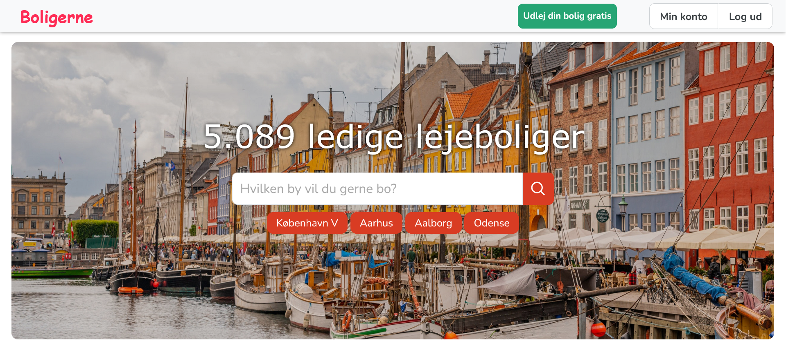

# Property rental platform

Site for listing and searching rental properties. Includes most of the core rental platform features.

## Features

- A nice design
- Submit property listings with images, description, price, location, etc.
- Search and filter rental properties by various criteria
  - Report fraudulent properties
- User authentication (sign up, login, logout)
  - Using `bcrypt` hashing algorithm for passwords
- **My account**-page which includes:
  - Saved rental properties
  - Your listed rental properties
  - Change name and password
- Admin panel
- Other pages:
  - Customer service page
  - About page
  - Some more pages...

## Tech stack

- Frontend: HTML, CSS, JavaScript, Bootstrap
- Backend: Django
- Database: SQLite

## How to run
- Open a terminal inside the `bolig` folder
  - Type:
  - `pip install -r .\requirements.txt`
  - `python manage.py runserver`
- **Admin panel:**
  - `localhost:8000/admin`
  - Username: admin
  - Password: admin

